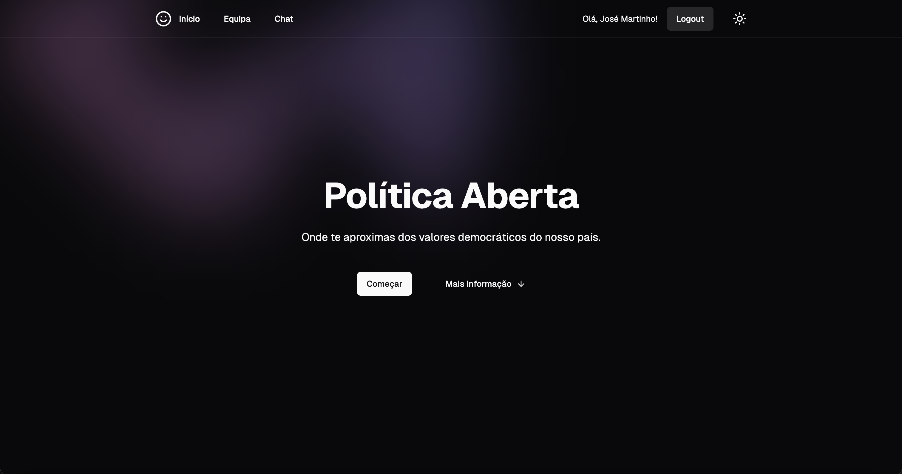

<!-- Improved compatibility of back to top link: See: https://github.com/othneildrew/Best-README-Template/pull/73 -->
<a name="readme-top"></a>
<!--
*** Thanks for checking out the Best-README-Template. If you have a suggestion
*** that would make this better, please fork the repo and create a pull request
*** or simply open an issue with the tag "enhancement".
*** Don't forget to give the project a star!
*** Thanks again! Now go create something AMAZING! :D
-->


<!-- PROJECT SHIELDS -->
<!--
*** I'm using markdown "reference style" links for readability.
*** Reference links are enclosed in brackets [ ] instead of parentheses ( ).
*** See the bottom of this document for the declaration of the reference variables
*** for contributors-url, forks-url, etc. This is an optional, concise syntax you may use.
*** https://www.markdownguide.org/basic-syntax/#reference-style-links
-->
[![Contributors][contributors-shield]][contributors-url]
[![Forks][forks-shield]][forks-url]
[![Stargazers][stars-shield]][stars-url]
[![Issues][issues-shield]][issues-url]
[![MIT License][license-shield]][license-url]
<!-- [![LinkedIn][linkedin-shield]][linkedin-url] -->


<!-- PROJECT LOGO -->
<br />
<div align="center">
  <a href="https://github.com/politica-aberta/frontend">
    
  </a>

<h3 align="center">Política Aberta</h3>

  <p align="center">
    Chat with Portguese political parties.
    <!-- <br />
    <a href="https://github.com/politica-aberta/frontend"><strong>Explore the docs »</strong></a> -->
    <br />
    <br />
    <a href="https://github.com/politica-aberta/frontend/issues">Report Bug</a>
    ·
    <a href="https://github.com/politica-aberta/frontend/issues">Request Feature</a>
  </p>
</div>


<!-- TABLE OF CONTENTS -->
<details>
  <summary>Table of Contents</summary>
  <ol>
    <li>
      <a href="#about-the-project">About The Project</a>
      <ul>
        <li><a href="#built-with">Built With</a></li>
      </ul>
    </li>
    <li>
      <a href="#getting-started">Getting Started</a>
      <ul>
        <li><a href="#prerequisites">Prerequisites</a></li>
        <li><a href="#installation">Installation</a></li>
      </ul>
    </li>
    <li><a href="#usage">Usage</a></li>
    <li><a href="#roadmap">Roadmap</a></li>
    <li><a href="#contributing">Contributing</a></li>
    <li><a href="#license">License</a></li>
    <li><a href="#contact">Contact</a></li>
    <li><a href="#acknowledgments">Acknowledgments</a></li>
  </ol>
</details>


<!-- ABOUT THE PROJECT -->
## About The Project

[](https://www.politica-aberta.pt)


<p align="right">(<a href="#readme-top">back to top</a>)</p>


### Built With

* [![React][React.js]][React-url]
* [![Next.js][Next.js]][Next-url]
* [![Supabase][Supabase.com]][Supabase-url]

<p align="right">(<a href="#readme-top">back to top</a>)</p>


<!-- GETTING STARTED -->
## Getting Started

This is the frontend of Política Aberta, an open source project to help the Portuguese electors to choose their vote. IT acts like a chatbot, where users can ask things to political parties and the answer is based on their political program. 

Feel free to clone this repo, run it locally and contribute!

### Prerequisites

The following prerequisites are needed to run the project:
* Node
    ```sh
    # Linux
    apt install node

    #OSX
    brew install node
    ```

* npm
  ```sh
  # Linux
  apt install npm

  #OSX
  brew install npm
  ```
* [Optional] Docker
    ```sh
    # Linux
    apt install docker

    #OSX
    brew install docker
    ```


### Installation

1. Clone the repo
   ```sh
   git clone https://github.com/politica-aberta/frontend.git && cd frontend
   ```
2. Install Python packages
   ```sh
   npm i
   ```
3. Edit `.env.local` file with your own data

<p align="right">(<a href="#readme-top">back to top</a>)</p>


<!-- USAGE EXAMPLES -->
## Usage

### Run locally

To run the project locally, simply run it with flask cli:
```sh
npm run dev
```


### Run with docker

You can also run it with docker
```sh
docker compose up --build
```

<p align="right">(<a href="#readme-top">back to top</a>)</p>


<!-- ROADMAP -->
## Roadmap

- [ ] Feature 1

See the [open issues](https://github.com/politica-aberta/frontend/issues) for a full list of proposed features (and known issues).

<p align="right">(<a href="#readme-top">back to top</a>)</p>


<!-- CONTRIBUTING -->
## Contributing

Contributions are what make the open source community such an amazing place to learn, inspire, and create. Any contributions you make are **greatly appreciated**.

If you have a suggestion that would make this better, please fork the repo and create a pull request. You can also simply open an issue with the tag "enhancement".
Don't forget to give the project a star! Thanks again!

1. Fork the Project
2. Create your Feature Branch (`git checkout -b feature/AmazingFeature`)
3. Commit your Changes (`git commit -m 'Add some AmazingFeature'`)
4. Push to the Branch (`git push origin feature/AmazingFeature`)
5. Open a Pull Request

<p align="right">(<a href="#readme-top">back to top</a>)</p>


<!-- LICENSE -->
## License

Distributed under the MIT License. See `LICENSE.txt` for more information.

<p align="right">(<a href="#readme-top">back to top</a>)</p>


<!-- CONTACT -->
## Contact

Hugo Pitorro - [xtwigs](https://www.github.com/xtwigs/) - pitorro@politica-aberta.pt

José Martinho - [jmartinhoj](https://www.github.com/jmartinhoj/) - martinho@politica-aberta.pt

Project Link: [https://github.com/politica-aberta/frontend](https://github.com/politica-aberta/frontend)

<p align="right">(<a href="#readme-top">back to top</a>)</p>


<!-- ACKNOWLEDGMENTS -->
## Acknowledgments


<p align="right">(<a href="#readme-top">back to top</a>)</p>


<!-- MARKDOWN LINKS & IMAGES -->
<!-- https://www.markdownguide.org/basic-syntax/#reference-style-links -->
[contributors-shield]: https://img.shields.io/github/contributors/politica-aberta/frontend.svg?style=for-the-badge
[contributors-url]: https://github.com/politica-aberta/frontend/graphs/contributors
[forks-shield]: https://img.shields.io/github/forks/politica-aberta/frontend.svg?style=for-the-badge
[forks-url]: https://github.com/politica-aberta/frontend/network/members
[stars-shield]: https://img.shields.io/github/stars/politica-aberta/frontend.svg?style=for-the-badge
[stars-url]: https://github.com/politica-aberta/frontend/stargazers
[issues-shield]: https://img.shields.io/github/issues/politica-aberta/frontend.svg?style=for-the-badge
[issues-url]: https://github.com/politica-aberta/frontend/issues
[license-shield]: https://img.shields.io/github/license/politica-aberta/frontend.svg?style=for-the-badge
[license-url]: https://github.com/politica-aberta/frontend/blob/master/LICENSE.txt
[linkedin-shield]: https://img.shields.io/badge/-LinkedIn-black.svg?style=for-the-badge&logo=linkedin&colorB=555
[linkedin-url]: https://linkedin.com/in/jmartinhoj
[product-screenshot]: images/screenshot.png
[Next.js]: https://img.shields.io/badge/next.js-000000?style=for-the-badge&logo=nextdotjs&logoColor=white
[Next-url]: https://nextjs.org/
[React.js]: https://img.shields.io/badge/React-20232A?style=for-the-badge&logo=react&logoColor=61DAFB
[React-url]: https://reactjs.org/
[Vue.js]: https://img.shields.io/badge/Vue.js-35495E?style=for-the-badge&logo=vuedotjs&logoColor=4FC08D
[Vue-url]: https://vuejs.org/
[Angular.io]: https://img.shields.io/badge/Angular-DD0031?style=for-the-badge&logo=angular&logoColor=white
[Angular-url]: https://angular.io/
[Svelte.dev]: https://img.shields.io/badge/Svelte-4A4A55?style=for-the-badge&logo=svelte&logoColor=FF3E00
[Svelte-url]: https://svelte.dev/
[Laravel.com]: https://img.shields.io/badge/Laravel-FF2D20?style=for-the-badge&logo=laravel&logoColor=white
[Laravel-url]: https://laravel.com
[Bootstrap.com]: https://img.shields.io/badge/Bootstrap-563D7C?style=for-the-badge&logo=bootstrap&logoColor=white
[Bootstrap-url]: https://getbootstrap.com
[JQuery.com]: https://img.shields.io/badge/jQuery-0769AD?style=for-the-badge&logo=jquery&logoColor=white
[JQuery-url]: https://jquery.com 
[supabase.com]: https://img.shields.io/badge/Supabase-20232A?style=for-the-badge&logo=supabase&logoColor=3ECF8E
[supabase-url]: https://supabase.com 
